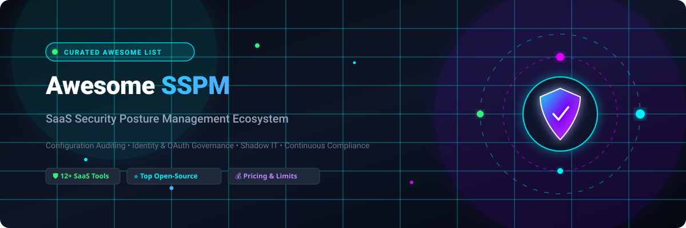

  

<h1 align="center">Awesome SaaS Security Posture Management (SSPM) 🛡️</h1>

  <strong>A curated list of top SaaS Security Posture Management (SSPM) platforms, open-source security tools, benchmarks, and frameworks for securing modern cloud and business applications.</strong>

  
  
  
  
  
  
  

---

## 📌 Overview

**SaaS Security Posture Management (SSPM)** systems continuously monitor and assess the security configurations of enterprise SaaS applications (e.g., Microsoft 365, Google Workspace, Salesforce, Slack, Workday, ServiceNow, GitHub, Okta). They automatically detect misconfigurations, manage identity & OAuth risk, discover shadow IT integrations, prevent data leakage, and ensure continuous regulatory compliance (SOC 2, ISO 27001, GDPR, HIPAA, CIS Benchmarks).

---

## 📑 Table of Contents
- [🏢 SaaS & Hosted Platforms](#-saashosted-platforms)
  - [📊 Market Size & Industry Dynamics](#-market-size--industry-dynamics)
  - [📋 SaaS Platforms Comparison Table](#-saas-platforms-comparison-table)
- [💻 Open-Source GitHub Projects](#-open-source-github-projects)
- [🏗️ Architectural Frameworks & Self-Hosted Blueprints](#️-architectural-frameworks--self-hosted-blueprints)
- [🤝 How to Contribute](#-how-to-contribute)
- [📈 Star History](#-star-history)
- [⚠️ Disclaimer](#️-disclaimer)

---

## 🏢 SaaS/Hosted Platforms

### 📊 Market Size & Industry Dynamics
> 💡 **Market Outlook**: The global SaaS Security Posture Management (SSPM) sector is estimated at **$500M–$1.3B in 2025–2026** and is projected to expand to **$3.5B–$8.7B by 2030–2034** (growing at an impressive **~27%–48% CAGR**). The sector is currently **moderately fragmented**, actively undergoing strategic consolidation as major cybersecurity, SASE, and CNAPP leaders (such as CrowdStrike acquiring Adaptive Shield, Palo Alto Networks, and Netskope) integrate pure-play SSPM solutions into unified defense platforms.

### 📋 SaaS Platforms Comparison Table
*Sorted by Company Scale (Market Cap / Valuation / Revenue) in descending order.*

| Platform | Company Scale (Valuation / Revenue) | Description | Pricing (Starting Tier) | Free Tier / Free Trial Limits |
| :--- | :--- | :--- | :--- | :--- |
| **[Palo Alto Prisma SaaS / SSPM](https://www.paloaltonetworks.com/)** | **~$105B+ Market Cap** (Public: `PANW`) / **~$8.0B+ ARR** | SaaS security and posture management within the Prisma / SaaS Security portfolio for configuration, threat, and data risk visibility. | Starts at **~$9,000/year** (100 Prisma Cloud Credits at ~$90/credit entry tier on AWS/Azure Marketplace) | **30-day free trial** protecting up to 50 cloud workloads/accounts and connected SaaS applications |
| **[Adaptive Shield / CrowdStrike Falcon Shield](https://www.crowdstrike.com/)** | **~$85B+ Market Cap** (Public: `CRWD`; Acquired for ~$300M) / **~$4.0B+ ARR** | SSPM capability integrated into the CrowdStrike Falcon platform, covering configuration posture, compliance, and app hardening across a broad SaaS catalog. | Starts at **~$59.99/device/year** (entry Falcon) / SSPM module starting from **~$3,000–$5,000/year** (~$3.50/user/month) | **15-day free trial** with access to Falcon platform modules & SaaS posture evaluation for up to 25 connectors/endpoints |
| **[Netskope SSPM](https://www.netskope.com/)** | **~$7.5B Valuation** (Late-Stage Pre-IPO) / **~$500M+ ARR** | SaaS security posture capabilities within the broader Netskope Security Service Edge (SSE) portfolio, alongside CASB and data protection. | Starts at **~£111–£120 (~$140–$150)/user/year** for SSPM/CASB packages (~$12.50/user/month) | **14-day free trial** / 30-day guided Proof of Concept (POC) with full API inspection for up to 3 cloud applications |
| **[BetterCloud](https://www.bettercloud.com/)** | **~$500M+ Valuation** (Acquired by Vista Equity) / **~$80M+ ARR** | SaaS operations and security platform focused on automated management, policy enforcement, and posture across business applications. | **Free tier available**; paid plans start at **~$3.00–$5.00/user/month** (~$36–$60/user/year) | **Free Forever plan** (Spend Optimization Basic: 1 financial integration, 1 extension, up to 10 contracts); **14 to 21-day free trial** for File Governance & automation modules |
| **[AppOmni](https://appomni.com/)** | **~$400M–$500M Valuation** ($123M+ Raised) / **~$30M–$50M ARR** | Deep configuration and posture management for critical enterprise SaaS (Salesforce, Workday, ServiceNow, M365, etc.), widely used for audit-grade governance. | Starts at **$7,500/year** (AWS Marketplace base tier for up to 100 users) | **14-day free trial** / Free SaaS Risk Assessment scanning 1 primary SaaS tenant (e.g., Microsoft 365 or Salesforce) |
| **[Grip Security](https://www.grip.security/)** | **~$300M–$400M Valuation** ($66M+ Raised) / **~$15M–$25M ARR** | SaaS security platform focused on discovering and securing the full SaaS estate, including shadow SaaS identified via identity and other signals. | Starts at **~$15,000/year** (~$3.00/user/month baseline enterprise package) | **14-day free trial** / Free SaaS Discovery Assessment evaluating historical SSO, IdP, and browser-identified SaaS apps |
| **[Obsidian Security](https://www.obsidiansecurity.com/)** | **~$250M–$300M Valuation** ($90M+ Raised) / **~$15M–$25M ARR** | SaaS security platform combining posture management with identity-aware threat detection and activity analysis for mature SOC teams. | Starts at **~$30/user/year** (~$2.50/user/month; entry package starting at **~$2,500/year**) | **14-day free trial** with core posture analysis & identity risk assessment for up to 5 core SaaS apps (e.g., M365, Google Workspace, Okta) |
| **[Wing Security](https://wing.security/)** | **~$100M–$150M Valuation** ($30M+ Raised) / **~$8M–$12M ARR** | SSPM and SaaS discovery platform strong on shadow IT, third-party app inventory, and supply-chain style risk across the SaaS estate. | **Free tier available**; paid SMB tier starts at **~$1,500/year** (~$125/month) | **Free Forever plan** (SaaS Discovery & SaaS Pulse: unlimited time, shadow IT discovery, MITRE CWSS security health score); **14-day free trial** for Pro automated remediation |
| **[Valence Security](https://www.valence.security/)** | **~$100M–$150M Valuation** ($32M+ Raised) / **~$10M–$15M ARR** | SSPM oriented toward SaaS-to-SaaS integrations, OAuth scopes, and collaborative remediation of third-party app risk. | Starts at **~$12,000/year** (~$2.50–$3.00/user/month entry baseline) | **14-day free trial** / Free SaaS-to-SaaS Risk Assessment covering up to 50 OAuth/third-party integrations |
| **[DoControl](https://www.docontrol.io/)** | **~$100M–$150M Valuation** ($45M+ Raised) / **~$10M–$15M ARR** | SaaS data and posture security platform with no-code workflows for governance, access control, and automated response. | Starts at **~$12,000/year** (~$2.50/user/month starter tier) | **14-day free trial** (via AWS Marketplace) / Free SaaS Risk Exposure Assessment scanning up to 10,000 SaaS assets and shares |
| **[Reco](https://www.reco.ai/)** | **~$50M–$80M Valuation** ($30M+ Raised) / **~$5M–$10M ARR** | AI-driven SaaS security platform analyzing user behavior, sharing patterns, and posture risks with an emphasis on low-noise findings. | Starts at **~$15,000/year** (~$3.50/user/month mid-market tier) | **14-day free trial** / SaaS & AI Risk Assessment analyzing up to 5 SaaS apps and connected generative AI tools |
| **[Spin.AI](https://www.spin.ai/)** | **~$30M–$50M Valuation** ($16M+ Raised) / **~$5M–$10M ARR** | SaaS security platform with posture, data protection, and backup-oriented capabilities for Microsoft 365 and Google Workspace. | Starts at **$3.00/user/month** ($36/user/year; minimum $5,000/year for enterprise contract) | **15-day free trial** for up to 50 users/mailboxes with full SpinSPM posture and data backup features |

---

## 💻 Open-Source GitHub Projects

*Sorted by GitHub Star Count in descending order.*

1. **[Prowler](https://github.com/prowler-cloud/prowler)**   
   Open-source security assessment, auditing, and compliance tool covering Microsoft 365, Azure, AWS, and GCP with over 300+ automated checks mapped to CIS, NIST, and GDPR benchmarks.

2. **[Steampipe](https://github.com/turbot/steampipe)**   
   Extensible SQL query engine and posture assessment tool for cloud & SaaS APIs. Features native plugins for Microsoft 365, Google Workspace, GitHub, Slack, Okta, Zoom, and Salesforce.

3. **[Scout Suite](https://github.com/nccgroup/ScoutSuite)**   
   Multi-cloud security posture auditing tool that queries APIs to gather configuration data, evaluates settings against risk baselines, and generates interactive HTML reports.

4. **[CloudQuery](https://github.com/cloudquery/cloudquery)**   
   High-performance open-source ELT framework extracting SaaS and cloud assets (Okta, GitHub, Google Workspace, Slack) into standard SQL databases for continuous posture validation.

5. **[CloudFox](https://github.com/BishopFox/cloudfox)**   
   Command-line tool designed for situational awareness, discovery, and identifying exploitable misconfigurations in cloud and identity services.

6. **[Cartography](https://github.com/lyft/cartography)**   
   Graph-based security consolidation tool mapping relationships between infrastructure, identity, and SaaS assets (Okta, Google Workspace, GitHub) into a Neo4j database to uncover hidden attack paths.

7. **[ScubaGear](https://github.com/cisagov/ScubaGear)**   
   CISA's official security configuration baseline assessment tool for Microsoft 365 tenants (evaluates Entra ID, Exchange Online, SharePoint/OneDrive, Teams, and Defender).

8. **[Monkey365](https://github.com/silverhack/monkey365)**   
   PowerShell-based security posture scanner and configuration auditor for Microsoft 365, Entra ID (Azure AD), and Azure cloud environments.

9. **[Aperio](https://github.com/writer/aperio)**   
   Open-source SSPM and SaaS detection & response project built for SIEM-native security teams; detects posture risks, inventories OAuth/shadow IT, and streams normalized findings into existing security stacks (connectors for GitHub, Slack, Google Workspace, Okta, and M365).

10. **[Open SSPM Spec](https://github.com/open-sspm/open-sspm-spec)**   
    Open, versioned specification for SaaS security compliance rulesets, schema definitions, and Rego/OPA policy benchmarks.

---

## 🏗️ Architectural Frameworks & Self-Hosted Blueprints

For security teams seeking full control or building custom in-house SSPM architectures:
- 🔄 **SIEM / Data Lake Integration**: Stream posture logs from tools like Aperio, CloudQuery, or Steampipe into open SIEM platforms (Wazuh, Security Onion, Elastic/ELK, OpenSearch).
- 📜 **Policy-as-Code (PaC)**: Evaluate SaaS API exports against Open Policy Agent (OPA) Rego rules using standards defined in the **Open SSPM Spec**.
- 🔑 **Identity & OAuth Inventory**: Enforce least privilege and periodically audit OAuth scopes across Microsoft Entra ID, Okta, and Google Workspace.
- 🌐 **Shadow SaaS Discovery**: Correlate Identity Provider (IdP) logs, CASB/SSE gateway logs, and browser extension telemetry to catch unsanctioned SaaS sprawl.

---

## 🤝 How to Contribute
1. 🍴 Fork the repository.
2. ✏️ Add or update entries in `README.md` (ensure factual descriptions, pricing tiers, and direct repository/site links).
3. 🧪 Verify that badges, links, and markdown tables render cleanly.
4. 🚀 Submit a Pull Request with a clear description of your changes.

---

## 📈 Star History

---

## ⚠️ Disclaimer
- This is a **community-curated** list for educational and informational purposes — not an endorsement.
- SSPM tools require privileged access to SaaS administrative APIs and identity systems. Open-source tools must be deployed with robust secret management, least privilege permissions, and audit logging.
- No automated tool replaces foundational SaaS admin hygiene, multi-factor authentication (MFA), and zero-trust access control.

---

  <strong>Curated with ❤️ for security engineers, DevSecOps, and cloud architects defending the modern SaaS stack.</strong>

